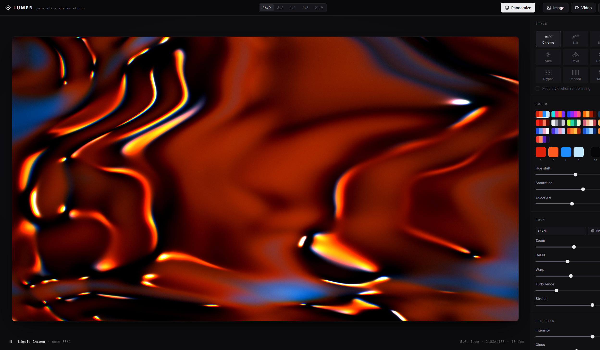
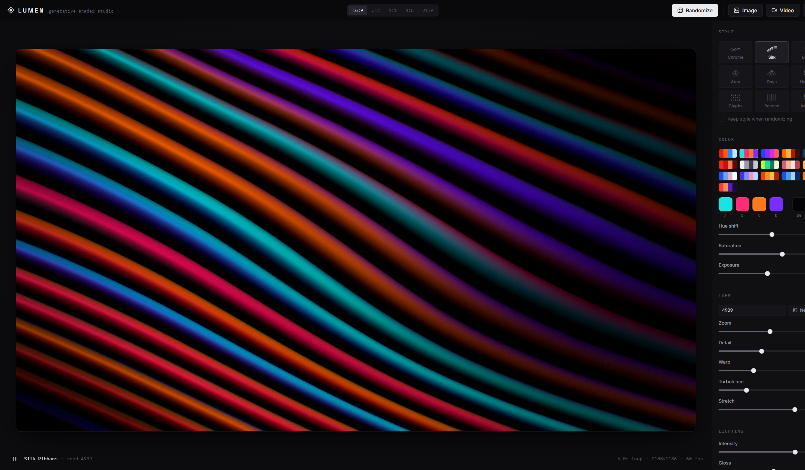
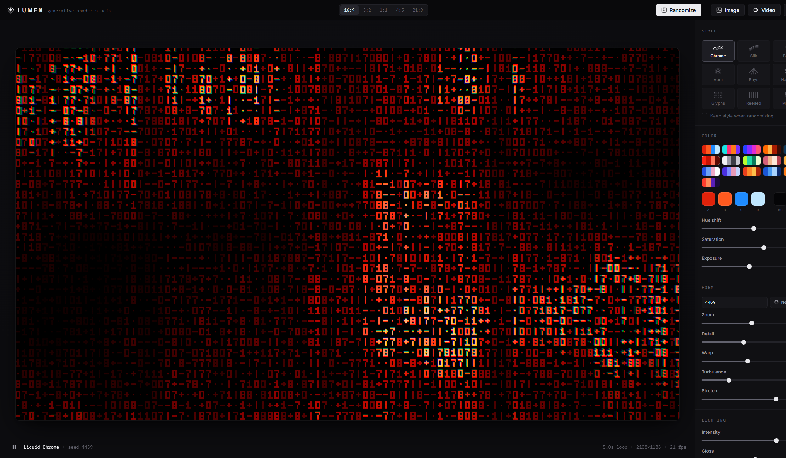

# LUMEN，生成式着色器工作室

一个自包含的 Web 工具，用来生成可循环的抽象 shader 视觉：液态金属、丝绸光带、柔和渐变、光环、光束、半调网点、数据字符、竖纹玻璃和像素马赛克。所有画面都通过 WebGL2 实时渲染，每段动画都能无缝循环。

## 运行方式

无需构建，也没有依赖。

- **本地：**双击 `index.html`，或运行 `npx http-server . -p 8080`
- **在线原版：**[lumenshaders.vercel.app](https://lumenshaders.vercel.app/)

需要支持 WebGL2 的浏览器，例如 Chrome、Edge 或 Firefox。

## 控制项

- **随机生成**：生成新的样式、配色、形态、光照和种子。也可以按 `R`。
- **样式**：9 个基础视觉模式，每个都有独立渲染器。勾选“随机时保留当前样式”可以锁定模式。
- **生成样式**：点击“新样式”会运行 12 基因样式合成器，生成基础模式之外的独立风格；“保存样式”会把喜欢的效果存到浏览器里。
- **渐变套图**：生成 4 到 12 个同源变体，样式、配色和参数一致，只更换种子，适合做网站首屏、卡片和分区背景。
- **颜色**：包含预设色板、4 个主色、背景色、色相偏移、饱和度和曝光。
- **形态**：包含种子、缩放、细节、扭曲、湍流和拉伸。
- **光照**：包含强度、光泽、角度、虹彩、辉光和对比。
- **质感**：包含颗粒、密度、脊线、色差、暗角和柔和度。
- **动态**：包含循环时长和位移。循环通过闭合噪声路径构造，因此首尾自然衔接。
- **分享**：每个设计都会生成 `LMN1.` 开头的设计码；复制设计码或链接后，别人可以还原同一套参数。
- `Space` 播放或暂停，`S` 保存 PNG。

完整说明见 `docs.html`。

## 导出

每个导出按钮都会先打开带实时预览和设置项的弹窗，再开始下载。

- **PNG**：最高 3840x2160，离屏完整质量渲染。
- **视频**：通过 WebCodecs 离线编码 WebM VP9/VP8，并使用内置 WebM writer 封装。支持 24、30、60 fps，时长可按循环次数或秒数设置。
- **GIF**：逐帧确定性渲染，在页面内编码为 GIF。可选择抖动、永久循环或播放一次。

## 文件结构

- `index.html` / `styles.css`：应用外壳和视觉系统
- `js/shaders.js`：包含 9 个模式的 fragment shader
- `js/engine.js`：WebGL2 引擎和渲染循环
- `js/gifenc.js`：GIF 编码器
- `js/webmmux.js`：WebCodecs 输出用 WebM/Matroska muxer
- `js/exporter.js`：PNG、视频和 GIF 导出流程
- `js/palettes.js`、`js/ui.js`、`js/main.js`：配色、控件构建、状态和随机器
